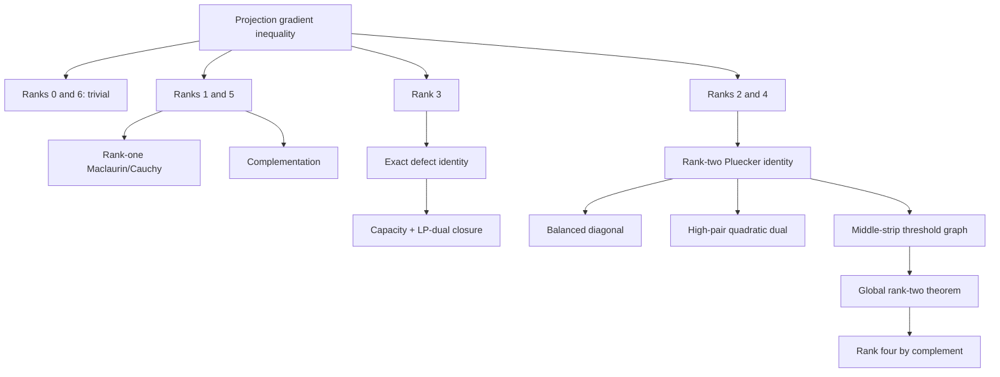

# No Free Collapse

[](https://github.com/Null-Square/no-free-collapse/actions/workflows/ci.yml)
[](LICENSE)

**Interaction-order limits of quantum-inspired reasoning.**

This repository contains the theorem statements, proof notes, CPU-verifiable tests, and reproducibility scripts for the **No Free Collapse** research program.

The central question is:

> If many reasoning fragments are encoded into a quantum-like latent state and an answer is produced by Born-style collapse, which higher-order interactions must already have been created before measurement?

The working principle is **no free collapse**: measurement can expose interference already present in the prepared state, while nonlinear preparation and input-dependent normalization must be counted as computational resources.

## Status at a glance

The repository deliberately separates proved results from open conjectures.

| Result | Status | Main proof / index |
| --- | --- | --- |
| Fixed-norm order-`r` preparation has Born interaction degree at most `2r` | **Proved** | [`docs/math.md`](docs/math.md) |
| The factor-of-two degree ceiling is tight | **Proved** | [`docs/math.md`](docs/math.md) |
| Input-dependent normalization can generate arbitrarily high exact interaction order | **Proved** | [`docs/math.md`](docs/math.md) |
| Conditioning controls high-order Walsh leakage exponentially | **Proved** | [`docs/conditioning.md`](docs/conditioning.md), [`docs/chebyshev.md`](docs/chebyshev.md) |
| Exact Gram representation and minimal latent dimension | **Proved** | [`docs/gram.md`](docs/gram.md) |
| Permutation/global-sign symmetric order-1 class | **Solved exactly** | [`docs/symmetric_optimality.md`](docs/symmetric_optimality.md) |
| Matched-pair symmetry-breaking class | **Solved exactly** | [`docs/paired.md`](docs/paired.md) |
| Universal low-conditioning hafnian bound; `m=4` sharp optimum | **Proved** | [`docs/hafnian_bound.md`](docs/hafnian_bound.md) |
| Six-variable rank-one, completion, and range reductions | **Proved** | [`docs/six_variable_rank_one.md`](docs/six_variable_rank_one.md), [`docs/diagonal_completion.md`](docs/diagonal_completion.md), [`docs/six_variable_range_bound.md`](docs/six_variable_range_bound.md) |
| Six-variable gradient contraction on every orthogonal projection rank `0,...,6` | **Proved** | [`docs/projection_gradient.md`](docs/projection_gradient.md), [`docs/rank_three_global_gradient.md`](docs/rank_three_global_gradient.md), [`docs/rank_two_global_projection.md`](docs/rank_two_global_projection.md) |
| Exact spectral-chain reduction from PSD contractions to nested projection kernels | **Proved reduction** | [`docs/spectral_polarization.md`](docs/spectral_polarization.md) |
| Mixed nested rank patterns `(1,5,5,5)` and `(1,1,1,5)` | **Proved** | [`docs/mixed_rank_1555.md`](docs/mixed_rank_1555.md) |
| Full PSD-contraction gradient inequality | **Open** | [`docs/RESULTS.md`](docs/RESULTS.md) |
| General even-`m` sharp hafnian optimum | **Open** | [`docs/RESULTS.md`](docs/RESULTS.md) |

For the complete theorem ledger, including proof and test locations, see **[`docs/RESULTS.md`](docs/RESULTS.md)**.

## Research map


The core resource-theoretic chain is

\[
\text{preparation order}
\to
\text{Born degree}
\to
\text{normalization resource}
\to
\text{conditioning}
\to
\text{interaction capacity}.
\]

The strongest completed six-variable geometric milestone is

\[
\boxed{
q_2(P)\le \frac14 q_1(P)
}
\]

for every real `6 x 6` orthogonal projection `P`, all ranks `0,...,6`.

The current open extension is

\[
0\preceq A\preceq I,
\qquad
q_2(A)\stackrel{?}{\le}\frac14q_1(A).
\]

No file in this repository presents that contraction inequality as proved.

## Reviewer quick start

The code is intentionally lightweight: NumPy plus pytest, with no GPU dependency.

```bash
git clone https://github.com/Null-Square/no-free-collapse.git
cd no-free-collapse
python -m venv .venv
source .venv/bin/activate        # Windows: .venv\Scripts\activate
python -m pip install -e '.[dev]'
python -m pytest
```

To reproduce the curated deterministic research outputs:

```bash
python experiments/reproduce_core.py
```

For a description of exact certificates, floating-point diagnostics, random seeds, and what CI verifies, see **[`docs/REPRODUCIBILITY.md`](docs/REPRODUCIBILITY.md)**.

## How to review the repository

A reviewer can follow this path without reconstructing the project history:

1. **[`docs/RESULTS.md`](docs/RESULTS.md)** — theorem ledger: statement, status, proof note, tests.
2. **[`docs/FIGURES.md`](docs/FIGURES.md)** — visual dependency diagrams and result maps.
3. **[`docs/REPRODUCIBILITY.md`](docs/REPRODUCIBILITY.md)** — verification commands and numerical/exact boundary.
4. **[`docs/PAPER_MATERIALS.md`](docs/PAPER_MATERIALS.md)** — paper-ready theorem map, figure plan, table plan, and appendix split.
5. Individual proof notes in `docs/` for full derivations.
6. `tests/` for CPU-verifiable regression and exact-certificate checks.

## Projection theorem: rank closure



This is a completed theorem, not a numerical rank scan.

## Repository structure

```text
src/no_free_collapse/   theorem-supporting implementation and exact utilities
tests/                  regression tests and exact certificate checks
docs/                   proof notes, result ledger, figures, reproducibility
experiments/            deterministic reproductions and exploratory scripts
.github/workflows/      CI configuration
```

The distinction between `tests/` and `experiments/` is intentional:

- **tests** protect identities, exact constants, certificates, and theorem-supporting computations;
- **experiments** reproduce examples or document exploratory numerics and are not substitutes for proofs.

## Main completed results

### Interaction-order and normalization

For Boolean inputs `x_i in {-1,+1}`, an order-`r` unnormalized amplitude has the form

\[
\widetilde\psi(x)=\sum_{|S|\le r}x_Su_S.
\]

With fixed norm, Born readout has interaction degree at most `2r`, and the factor two is tight. If the norm depends on the input, normalization becomes a nonlinear computational resource and can generate arbitrarily high exact degree.

If the squared norm has condition number `kappa`, define

\[
\rho=\frac{\sqrt\kappa-1}{\sqrt\kappa+1},
\qquad
m=\left\lfloor\frac{k-1}{2r}\right\rfloor.
\]

Then every order-`k` Walsh coefficient obeys

\[
|\widehat p(S)|\le\frac{\rho^m}{1+\rho^{2m}}.
\]

### Exact model classes

The full permutation/global-sign symmetric real order-1 class is solved exactly. That symmetric optimum is not globally optimal: a symmetry-breaking matched-pair construction is stronger, and the entire matched-pair block class is solved exactly.

### Hafnian regime

The first full-order term generated by a bounded PSD quadratic normalizer is a hafnian. A universal bound follows from a Chebyshev/minimax argument, and the four-variable extremal problem is solved globally with optimum `1/16`.

For six variables, the repository contains:

- unrestricted first- and strict second-order local-optimality results at the disjoint-pair point;
- a global rank-one theorem;
- an exact minimum-trace diagonal-completion reduction with elliptope dual;
- a sharp range-only theorem reducing the PSD problem to a thin near-minimal-completion shell;
- a complete projection-gradient theorem for every projection rank;
- an exact nested spectral homogenization for general PSD contractions;
- the first nontrivial mixed nested spectral coefficient theorem.

## What is not claimed

The following remain open unless a later proof is explicitly merged and the ledger is updated:

1. the full PSD-contraction gradient inequality;
2. the final sharp six-variable PSD hafnian extremal inequality in complete generality;
3. the general even-variable conjecture that the equal pair construction globally maximizes the relevant hafnian at value `m^{-m/2}`.

The repository also does **not** claim novelty for standard background tools such as Boolean Fourier analysis, Chebyshev approximation, Helstrom discrimination, hafnians, generic SDP duality, zeon algebras, Schur-Horn theory, or symmetric-polynomial half-degree principles. Novelty claims should attach to the specific resource-theoretic reductions and extremal theorems proved here.

## Paper preparation

The current theorem set is sufficient for a complete manuscript framed around interaction-order limits, normalization/conditioning as resources, exact solvable classes, and the completed projection-gradient theorem. The PSD-contraction extension is treated as an open frontier rather than a prerequisite for the paper.

See **[`docs/PAPER_MATERIALS.md`](docs/PAPER_MATERIALS.md)** for the proposed theorem ordering, main-text/appendix split, result tables, and figure inventory.

## License

MIT. See [`LICENSE`](LICENSE).
