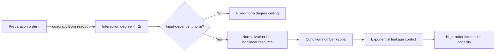
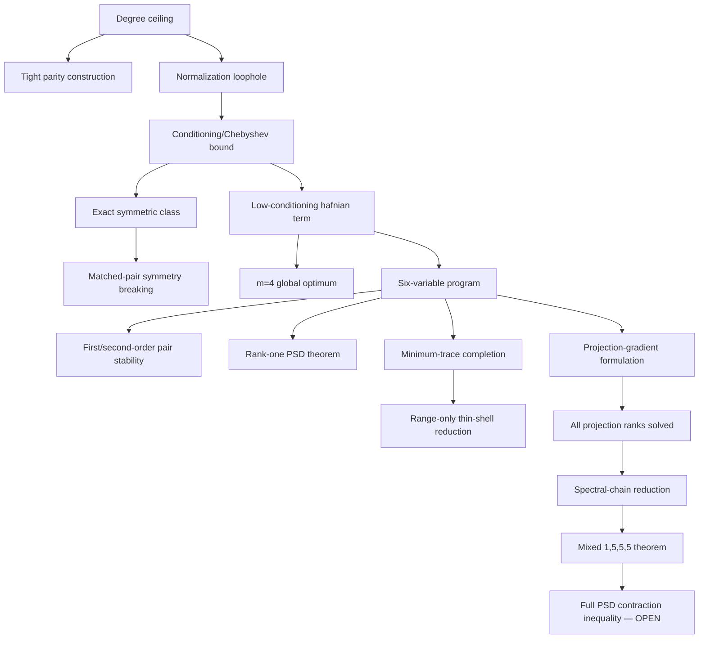
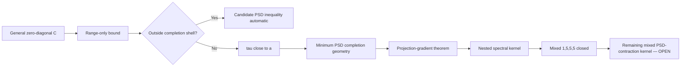
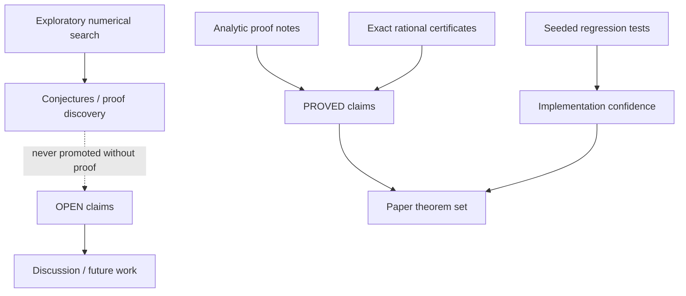

# Figure set

These diagrams are maintained as Mermaid source so they render directly on GitHub, remain diffable, and can later be exported to SVG/PDF for the manuscript.

## Figure 1 — No Free Collapse resource chain

**Purpose:** main conceptual figure for README / introduction.



Suggested paper caption:

> **No Free Collapse resource chain.** Fixed-norm order-`r` preparations can expose at most order-`2r` interactions under Born readout. Higher exact order can enter through input-dependent normalization, whose ability to leak interaction mass is quantitatively controlled by conditioning.

---

## Figure 2 — Theorem dependency map

**Purpose:** reviewer orientation and paper roadmap.



Suggested paper caption:

> **Logical structure of the results.** The resource-theoretic degree/conditioning results lead to exact model classes and a low-conditioning hafnian problem. The six-variable branch is progressively reduced through completion, range, projection, and spectral structure. Solid nodes are completed results; the final PSD-contraction step remains open.

---

## Figure 3 — Projection-rank closure

**Purpose:** centerpiece of the technical six-variable section.

```mermaid
flowchart TD
    A[Target: q2(P) <= q1(P)/4] --> B[Ranks 0,6]
    A --> C[Ranks 1,5]
    A --> D[Rank 3]
    A --> E[Ranks 2,4]

    B --> B1[Trivial]

    C --> C1[Rank 1: Maclaurin + Cauchy]
    C1 --> C2[Rank 5: complementation]

    D --> D1[Equal-diagonal involution]
    D1 --> D2[Exact defect identity]
    D2 --> D3[Capacity + dual closure]

    E --> E1[Rank 2: Pluecker structure]
    E1 --> E2[Balanced diagonal]
    E1 --> E3[High-pair quadratic dual]
    E1 --> E4[Middle strip]
    E4 --> E5[Low-edge threshold graph]
    E5 --> E6[Seven-edge exceptional case]
    E6 --> E7[Global rank 2]
    E7 --> E8[Rank 4 by complement]

    B1 --> Z[All projection ranks 0,...,6]
    C2 --> Z
    D3 --> Z
    E8 --> Z
```

Suggested paper caption:

> **Closure of the six-variable projection-gradient theorem.** Ranks one/five, three, and two/four require distinct geometric reductions. Their combination proves `q2(P) <= q1(P)/4` for every real `6 x 6` orthogonal projection.

---

## Figure 4 — Six-variable extremal funnel

**Purpose:** explain why the unresolved global PSD problem is already narrow.



Suggested paper caption:

> **Six-variable extremal funnel.** A range theorem eliminates every configuration whose PSD completion cost is not close to the Boolean lower bound. The remaining structured regime motivates the projection-gradient and nested spectral analyses.

---

## Figure 5 — Exact / numerical / open boundary

**Purpose:** reviewer-facing robustness figure.



Suggested paper caption:

> **Evidence hierarchy used in the repository.** Numerical searches guide conjecture formation but are never promoted to theorem status. Analytic derivations and finite exact certificates define the paper theorem set; tests protect the implementation of those results.

---

## Figure 6 — Paper narrative

**Purpose:** manuscript planning, not necessarily a final figure.


This is the recommended section-level narrative for the first paper.

## Export guidance

For submission-quality graphics, keep these Mermaid sources as the canonical editable versions and export them to vector format (`SVG` or `PDF`) once the target journal template is selected. The manuscript should use vector graphics rather than screenshots.

The mathematical content of the figures should not depend on journal styling; only typography, line weight, and page width should change during final production.
